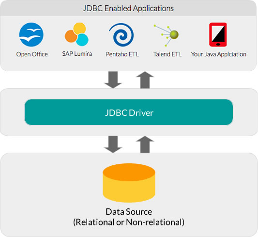

# Java Database Connectivity (JDBC)

JDBC, Java diliyle veri tabanlarına bağlanıp sorgu çalıştırmak, veri tabanı ile etkileşimli uygulamalar geliştirmek için ortaya çıkmış bir kütüphanedir. 
Java Standard Edition (JavaSE) içinde yer almaktadır. Dolayısıyla JDK içinde varsayılan olarak hazır kullanılabilir şekilde gelmektedir.

JDBC API her veri tabanı yönetim sistemi için yazılmış olan sürücü kütüphanelerini kullanarak veri tabanı işlemlerini yapabilmeyi sağlar. Veri tabanıyla 
iletişimde kullanılabilecek birçok başka soyutlama olmasına karşın JDBC bunların hepsinin temelinde bulunur. Bu nedenle JDBC'nin standartını öğrenmek önemlidir.

Java ile veri tabanı ile etkileşimde olan kodları yazdığınızda sürücü kütüphane örneğin MySQL’den Oracle veri tabanı sistemine geçse bile hiçbir değişiklik gerektirmeden 
kullanımını sağlar. Böylece, Java ile veri tabanıyla işlemler yapabilmek için yazdığınız kodları değiştirmeden dilediğiniz veri tabanı sistemiyle çalışabilirsiniz. 
Böyle yüksek bir soyutluluk sağlaması Java kodlarının yeniden kullanılabilirliğini arttırmaktadır. JDBC API ile veri tabanı bağlantısı oluşturup, tablolar üzerinde 
sorgu çalıştırabilirsiniz. Sorgulama, veri güncelleme, silme veya yeni kayıt ekleme işlemlerini yapabilirsiniz.



## 5 Adımda JDBC’yi Kullanmak

JDBC ile veritabanı etkileşimi kabaca 5 adımdan oluşmaktadır.

1-Veri tabanı sürücü sınıfını kaydetmekle başlayabiliriz. JDBC API hangi veri tabanı sürücüsüyle çalışacağını bilmelidir. Bu nedenle yazılımı gerçekleştirirken bu bilgiyi belirtmek gerekir.


```
Class.forName("com.mysql.jdbc.Driver");  
```


Class sınıfındaki “forName” fonksiyonu ile hangi veri tabanı sürücüsünü kullanacağımızı belirtiyoruz. Örneğin burada “MySQL” sürücüsünü kullanacağımızı söylemişiz.

 

2-Sürücü sınıf belirlendikten hemen sonra veri tabanı bağlantısı kurulur. Modern veri tabanı yönetim sistemlerinin istemci-sunucu (client-server) mimarisinden oluştuğunu bahsetmiştik.


```
Connection dbConnection = DriverManager.getConnection(  
"jdbc:mysql://remotemysql.com:3306/S9HHYQdP81?useSSL=false<Sunucu adı>", "S9HHYQdP81<kullanıcı adı>", "7mR2jSrEgT<şifre>");
```


DriverManager sınıfındaki “getConnection” fonksiyonu ile veri tabanına bir bağlantı açarız. Bu fonksiyona uzak bir sunucuda yer alan veri tabanı sunucu adresimizi vereceğiz. Bu adres IP ve Hostname şeklinde olabilir. Burada “remotemysql.com” sunucusundaki MySQL sunucusuna bağlanacağımı söylüyorum. Ardından, bağlantı kuracak kullanıcının, kullanıcı adı ve şifresini veriyorum. Böylece, veri tabanı sunucusuna bir bağlantı açmış oluyorum.


3-Bağlantı kurulduktan sonra JDBC API ile artık sorgu çalıştırabiliriz.

```
Statement statement = dbConnection.createStatement();  
```

“dbConnection” isimli nesne veri tabanı sunucusuyla aramızdaki bağlantı nesnesidir. Bu nesne üzerinden “createStatement” fonksiyonu ile sorgu hazırlayabileceğimiz “Statement” tipinde bir nesne alırız. SQL sorgumuzu bu sorgu üzerinden yapacağız.

 

4-Sorgu nesnemiz hazır olduğu için bir SQL ifadesi hazırlayıp veri tabanı sunucusunda bu sorgu işletilir ve sorgu sonucu “ResultSet” tipinde bir nesne ile geri döndürülür.


```
ResultSet resultSet = statement.executeQuery("select * from employees");  
  
while(resultSet.next())
{  
        System.out.println(resultSet.getInt(1) + " " + resultSet.getString(2));  
} 
```

 “executeQuery” fonksiyonu ile veri tabanı sunucusuna basit “SELECT” sorgusu attık. Bunun sonucunda “ResultSet” tipinde bir nesnede veri tabanından dönen kayıtlar geldi. Bu kayıtları bir “while” döngüsü ile işletip erişebiliriz. “next” fonksiyonu her çağrıldığında sonuç kümesinden bir satır kayıt getirir. Bu satır üzerindeki sütunlara indis yoluyla veya direkt sütun isimlerini vererek erişlebiliriz.

 

5-İşimiz bitince veri tabanı sunucu ile olan bağlantımızı kapatırız. 

```
dbConnection.close();  
```


“Connection” tipindeki sınıftan bir nesne ile veri tabanı bağlantımızı oluşturmuştuk. Aynı şekilde bu nesne üzerindeki “close” fonksiyonu ile bağlantıyı kapatıyoruz.


## Kaynak:
* [Figure 1](https://www.simba.com/resources/jdbc/)
* [Figure 2](https://ducmanhphan.github.io/2020-01-09-How-to-use-JDBC-to-connect-database-in-Java-project/)
  